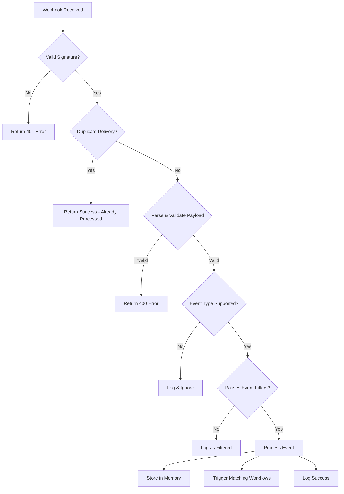

Notra processes specific events from connected integrations and transforms them into actionable data for your workflows.

## GitHub Events

Notra listens to the following GitHub webhook events:

### Push Event

Triggered when commits are pushed to the default branch of a repository.

<ResponseField name="Event Type" type="string" required>
  `push`
</ResponseField>

<ResponseField name="Action" type="string" required>
  `pushed`
</ResponseField>

#### Payload Structure

<CodeGroup>
  ```json Example Payload
  {
    "type": "push",
    "action": "pushed",
    "data": {
      "ref": "refs/heads/main",
      "branch": "main",
      "commits": [
        {
          "id": "7fd1a60b01f91b314f59955a4e4d4e80d8edf11d",
          "message": "Add new feature",
          "author": {
            "name": "Jane Developer",
            "email": "jane@example.com",
            "username": "janedev"
          },
          "timestamp": "2024-03-02T10:30:00Z",
          "url": "https://github.com/owner/repo/commit/7fd1a60b01f91b314f59955a4e4d4e80d8edf11d"
        }
      ],
      "headCommit": {
        "id": "7fd1a60b01f91b314f59955a4e4d4e80d8edf11d",
        "message": "Add new feature"
      }
    }
  }
  ```

  ```typescript Type Definition
  interface PushEvent {
    type: 'push';
    action: 'pushed';
    data: {
      ref: string;
      branch: string;
      commits: Array<{
        id: string;
        message: string;
        author: {
          name: string;
          email: string;
          username?: string;
        };
        timestamp: string;
        url: string;
      }>;
      headCommit: {
        id: string;
        message: string;
      } | null;
    };
  }
  ```
</CodeGroup>

#### Event Filtering

Push events are **only processed** when:

<Check>Commits are pushed to the **default branch** (usually `main` or `master`)</Check>
<Check>At least **one commit** is included in the push</Check>

<Note>
  Pushes to feature branches or tags are ignored. Only the default branch is tracked to reduce noise.
</Note>

#### Headers

```http
X-GitHub-Event: push
X-Hub-Signature-256: sha256=...
X-GitHub-Delivery: 12345678-1234-1234-1234-123456789abc
Content-Type: application/json
```

### Release Event

Triggered when a new release is published or pre-released in a repository.

<ResponseField name="Event Type" type="string" required>
  `release`
</ResponseField>

<ResponseField name="Actions" type="string[]" required>
  `published`, `prereleased`
</ResponseField>

#### Payload Structure

<CodeGroup>
  ```json Example Payload
  {
    "type": "release",
    "action": "published",
    "data": {
      "tagName": "v1.2.0",
      "name": "Version 1.2.0",
      "body": "## What's Changed\n- New feature X\n- Bug fix Y",
      "prerelease": false,
      "draft": false,
      "publishedAt": "2024-03-02T14:30:00Z",
      "url": "https://github.com/owner/repo/releases/tag/v1.2.0"
    }
  }
  ```

  ```typescript Type Definition
  interface ReleaseEvent {
    type: 'release';
    action: 'published' | 'prereleased';
    data: {
      tagName: string;
      name: string | null;
      body: string | null;
      prerelease: boolean;
      draft: boolean;
      publishedAt: string | null;
      url: string;
    };
  }
  ```
</CodeGroup>

#### Event Filtering

Release events are **only processed** for:

<Check>Action is `published` or `prereleased`</Check>
<Check>Draft releases are **excluded** (unless action is `created`)</Check>

<Warning>
  Draft releases are typically not processed to avoid triggering workflows on unpublished releases.
</Warning>

#### Headers

```http
X-GitHub-Event: release
X-Hub-Signature-256: sha256=...
X-GitHub-Delivery: 12345678-1234-1234-1234-123456789abc
Content-Type: application/json
```

### Ping Event

Sent by GitHub when a webhook is first configured or manually tested.

<ResponseField name="Event Type" type="string" required>
  `ping`
</ResponseField>

#### Payload Structure

```json
{
  "event": "ping",
  "delivery": "12345678-1234-1234-1234-123456789abc"
}
```

<Note>
  Ping events are automatically acknowledged and do not trigger any workflows. They're used solely for connectivity testing.
</Note>

## Linear Events

Linear webhook support is currently in development. Events are received and logged but not yet fully processed.

### Supported Actions

<Warning>
  Linear webhooks are acknowledged but event processing is not yet implemented. Check back for updates on Linear event support.
</Warning>

#### Headers

```http
Linear-Signature: <signature>
Content-Type: application/json
```

## Event Processing Pipeline

When a webhook event is received, Notra follows this processing pipeline:



### Memory Storage

Processed events are stored in Notra's memory system for AI context:

<CodeGroup>
  ```typescript Memory Entry Creation
  const dataSnippet = JSON.stringify({ 
    eventType, 
    repository, 
    action, 
    data 
  });

  const text = `GitHub ${eventType} event for ${repository} (${action}).\n\nData:\n${dataSnippet}`;

  await fetch('https://api.supermemory.ai/v3/documents', {
    method: 'POST',
    headers: {
      'Authorization': `Bearer ${apiKey}`,
      'Content-Type': 'application/json'
    },
    body: JSON.stringify({
      content: text.trim(),
      containerTag: organizationId,
      customId: `github:${repositoryId}:${deliveryId}`,
      metadata: {
        source: 'github_webhook',
        eventType,
        repository
      }
    })
  });
  ```

  ```json Memory Metadata
  {
    "source": "github_webhook",
    "eventType": "push",
    "repository": "owner/repo"
  }
  ```
</CodeGroup>

<Note>
  Only `push` and `release` events are stored in memory. This provides your AI agents with context about recent code changes and releases.
</Note>

## Workflow Triggers

Webhook events can automatically trigger content workflows based on configured triggers:

### Trigger Matching

```typescript
// Find triggers matching this webhook event
const matchingTriggers = await db
  .select()
  .from(contentTriggers)
  .where(
    and(
      eq(contentTriggers.organizationId, organizationId),
      eq(contentTriggers.sourceType, 'github_webhook'),
      eq(contentTriggers.enabled, true),
      // Repository ID is in the targets array
      sql`(targets->'repositoryIds') @> ${JSON.stringify([repositoryId])}::jsonb`
    )
  );

// Trigger matching workflows
for (const trigger of matchingTriggers) {
  const eventTypes = trigger.sourceConfig.eventTypes ?? [];
  
  if (eventTypes.length === 0 || eventTypes.includes(eventType)) {
    await triggerEventNow({
      triggerId: trigger.id,
      eventType,
      eventAction,
      eventData,
      repositoryId,
      deliveryId
    });
  }
}
```

### Event Type Filtering

Triggers can be configured to respond to specific event types:

<CodeGroup>
  ```json All Events
  {
    "sourceType": "github_webhook",
    "sourceConfig": {
      "eventTypes": []
    }
  }
  ```

  ```json Specific Events Only
  {
    "sourceType": "github_webhook",
    "sourceConfig": {
      "eventTypes": ["push", "release"]
    }
  }
  ```
</CodeGroup>

## Event Logging

All webhook events are logged for debugging and monitoring:

### Log Structure

<ResponseField name="id" type="string" required>
  Unique log identifier (e.g., `log_a1b2c3d4`)
</ResponseField>

<ResponseField name="referenceId" type="string">
  External delivery ID (e.g., GitHub's `X-GitHub-Delivery` header)
</ResponseField>

<ResponseField name="title" type="string" required>
  Human-readable log title (e.g., "Processed push event")
</ResponseField>

<ResponseField name="integrationType" type="string" required>
  Integration type: `github`, `linear`, `slack`, etc.
</ResponseField>

<ResponseField name="direction" type="string" required>
  `incoming` or `outgoing`
</ResponseField>

<ResponseField name="status" type="string" required>
  `success`, `failed`, or `pending`
</ResponseField>

<ResponseField name="statusCode" type="number">
  HTTP status code (200, 400, 401, etc.)
</ResponseField>

<ResponseField name="errorMessage" type="string">
  Error description if status is `failed`
</ResponseField>

<ResponseField name="payload" type="object">
  Event data and metadata
</ResponseField>

<ResponseField name="createdAt" type="string" required>
  ISO 8601 timestamp
</ResponseField>

### Example Logs

<CodeGroup>
  ```json Success Log
  {
    "id": "log_a1b2c3d4",
    "referenceId": "12345678-1234-1234-1234-123456789abc",
    "title": "Processed push event",
    "integrationType": "github",
    "direction": "incoming",
    "status": "success",
    "statusCode": 200,
    "errorMessage": null,
    "payload": {
      "event": "push",
      "action": "pushed",
      "data": { ... }
    },
    "createdAt": "2024-03-02T10:30:00.000Z"
  }
  ```

  ```json Failed Log
  {
    "id": "log_x9y8z7w6",
    "referenceId": "87654321-4321-4321-4321-cba987654321",
    "title": "Invalid webhook signature",
    "integrationType": "github",
    "direction": "incoming",
    "status": "failed",
    "statusCode": 401,
    "errorMessage": "Invalid webhook signature",
    "payload": null,
    "createdAt": "2024-03-02T10:35:00.000Z"
  }
  ```

  ```json Filtered Event Log
  {
    "id": "log_m5n6o7p8",
    "referenceId": "11112222-3333-4444-5555-666677778888",
    "title": "Filtered push event",
    "integrationType": "github",
    "direction": "incoming",
    "status": "success",
    "statusCode": 200,
    "errorMessage": null,
    "payload": {
      "event": "push",
      "action": "pushed",
      "filtered": true
    },
    "createdAt": "2024-03-02T10:40:00.000Z"
  }
  ```
</CodeGroup>

## Common Event Scenarios

### Scenario 1: New Release Published

```json
// GitHub sends release webhook
{
  "action": "published",
  "release": {
    "tag_name": "v2.0.0",
    "name": "Major Release 2.0",
    "body": "Breaking changes and new features",
    "prerelease": false
  },
  "repository": {
    "full_name": "acme/api"
  }
}

// Notra processes and stores in memory
// Triggers configured workflows
// Returns success response
```

### Scenario 2: Push to Main Branch

```json
// GitHub sends push webhook
{
  "ref": "refs/heads/main",
  "commits": [
    {
      "id": "abc123",
      "message": "Fix critical bug",
      "author": { "name": "Dev" }
    }
  ],
  "repository": {
    "default_branch": "main",
    "full_name": "acme/web"
  }
}

// Notra validates signature
// Processes push event
// Stores commit info in memory
// Triggers documentation update workflow
```

### Scenario 3: Invalid Signature

```json
// GitHub sends webhook with invalid signature
// X-Hub-Signature-256: sha256=invalid_signature

// Notra verifies signature fails
// Returns 401 error
// Logs failed attempt
{
  "error": "Invalid webhook signature"
}
```

## Next Steps

<CardGroup cols={2}>
  <Card title="Webhooks Overview" icon="webhook" href="/api/webhooks/overview">
    Learn about webhook setup and security
  </Card>

  <Card title="Configure Triggers" icon="bolt" href="/automation/event-based">
    Set up automated workflows for webhook events
  </Card>
</CardGroup>
