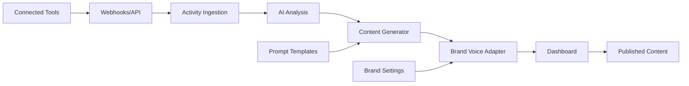

Notra automates content creation by connecting to your team's tools, analyzing activity with AI, and generating drafts tailored to your brand voice. Here's how the system works from start to finish.

## System Overview

Notra operates as an event-driven content pipeline that transforms engineering and product work into polished content. The system runs continuously in the background, monitoring your connected tools and generating content when meaningful activity occurs.

<Steps>
  <Step title="Connect your tools">
    Link GitHub and Linear to Notra. GitHub repositories can send webhook events, and Linear workspaces provide issue context. Slack support is planned.
  </Step>

  <Step title="Activity ingestion">
    Notra pulls updates from connected tools like merged pull requests, releases, commits, and completed Linear issues. Activity is normalized into a common internal format for consistent processing.
  </Step>

  <Step title="AI analysis">
    AI analyzes incoming activity to identify what changed and why it matters. The system prioritizes high-signal updates including major features, bug fixes, security improvements, and performance enhancements.
  </Step>

  <Step title="Content generation">
    Based on the analysis, Notra produces structured drafts for changelogs, blog posts, and social media updates. The system uses prompt templates and can make tool calls to fill in missing context.
  </Step>

  <Step title="Brand voice adaptation">
    Generated content is adapted to match your workspace's preferred tone and custom instructions while maintaining technical accuracy and readability.
  </Step>

  <Step title="Review and publish">
    Drafts appear in your dashboard as publish-ready content. Review, edit if needed, and share with your audience.
  </Step>
</Steps>

## Content Generation Modes

Notra generates content in two primary ways:

### Event-Driven Generation

When significant events occur in your connected tools, Notra automatically triggers content generation:

* **GitHub releases**: New version published
* **Push events**: Commits merged to main branch
* **Pull request merges**: Feature work completed

The system analyzes the event context, retrieves relevant data (commits, PR details, release notes), and generates appropriate content.

<Info>
  Event-driven generation typically focuses on a narrow time window around the event (approximately 1 hour) to ensure the content is directly related to the triggering activity.
</Info>

### Scheduled Generation

Notra can run on a schedule to create periodic content summaries:

* Weekly changelog updates
* Monthly product highlights
* Regular social media posts

Scheduled workflows look back over a configured timeframe (e.g., 7 days, 30 days) to gather all relevant activity and create comprehensive summaries.

## AI-Powered Analysis

The AI layer does more than just summarize commits. It understands context:

**What the AI evaluates:**

* Technical significance (breaking changes, new features, security fixes)
* User impact (customer-facing improvements, bug fixes)
* Relevance to target audience (developer vs. end-user facing)
* Priority ordering (security > breaking changes > features > performance)

**What gets filtered out:**

* Internal maintenance work
* Dependency updates without user impact
* Code formatting and linting changes
* Test-only updates
* Routine infrastructure chores

<Tip>
  Notra uses different AI prompts based on your selected tone profile (Conversational, Professional, Casual, or Formal) to ensure the output matches your communication style.
</Tip>

## Data Flow

Here's how information flows through the system:

**Key components:**

* **Connected Tools**: GitHub and Linear provide raw activity data. Slack is planned.
* **Activity Ingestion**: Normalizes different data formats into a unified structure
* **AI Analysis**: Evaluates significance and extracts key information
* **Content Generator**: Creates structured drafts using specialized agents
* **Brand Voice Adapter**: Applies tone and custom instructions
* **Dashboard**: Stores publish-ready content for review

## GitHub Integration Deep Dive

Since most content comes from code activity, the GitHub integration is particularly sophisticated:

**Available tools for AI agents:**

* `getPullRequests`: Fetches detailed PR context including title, description, reviewers, and merge status
* `getReleaseByTag`: Retrieves release notes and version information
* `getCommitsByTimeframe`: Gathers commit history with pagination support

The AI agent can call these tools during content generation to fill gaps in understanding. For example, if a webhook only provides commit IDs, the agent can fetch full commit messages and author information.

<Note>
  Notra respects GitHub API rate limits and implements intelligent caching to minimize redundant requests during content generation.
</Note>

## Security and Privacy

**How Notra handles your data:**

* OAuth tokens are encrypted and stored securely
* Only repositories you explicitly connect are accessed
* Integration IDs enforce access control, so agents can only query allowed repositories
* Webhook payloads are sanitized before being passed to AI
* Custom instructions are isolated to prevent prompt injection

## Continuous Operation

Once configured, Notra works autonomously:

1. Monitors connected tools 24/7 for relevant activity
2. Triggers content generation based on events or schedule
3. Stores drafts in your dashboard
4. Continues background generation without manual intervention

You control when and what to publish. Notra handles the heavy lifting of content creation.
